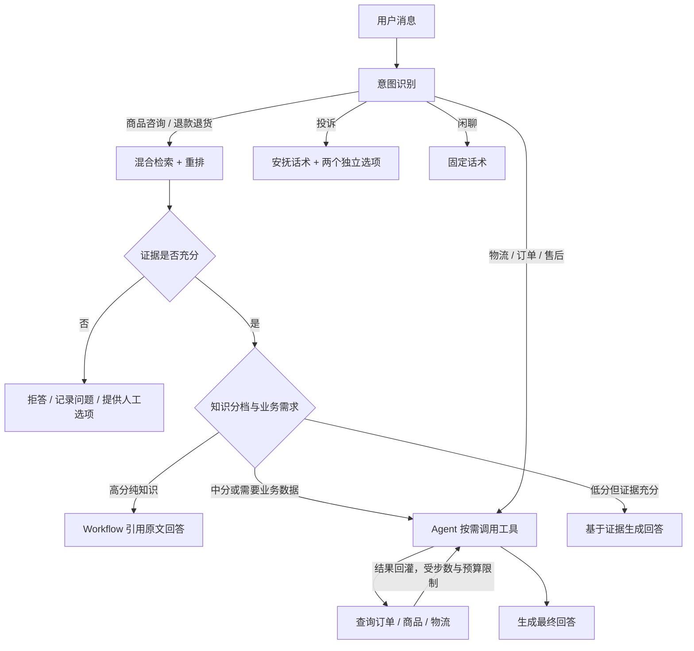

# 智能电商客服

一个可以在本地运行的中文客服系统：在聊天页提问，系统根据意图查询知识库或调用业务工具，流式返回回答，并展示工具轨迹和可点击的知识来源。

基于 **FastAPI + LangChain + LangGraph**，采用外层固定 Workflow、内层 Agent 的结构。模型通过 OpenAI 兼容接口接入；MySQL 保存业务数据，PostgreSQL 保存图检查点，Milvus 提供混合检索。

查看成果可打开 [项目展示页](showcase/index.html)，其中包含真实截图、演示视频和技术设计。对外分享只需发送独立的 [展示包目录](showcase/README.md)，无需提供完整仓库。

## Agent 能做什么

| 功能 | 使用效果 |
| --- | --- |
| 知识问答 | 回答商品规格、退货政策等问题，点击引用编号查看原文和章节路径 |
| 业务查询 | Agent 按需调用订单、商品、物流工具，聊天气泡显示工具徽章 |
| 多步处理 | 根据中间结果继续查工具，例如先查订单，再查物流；缺少信息时追问 |
| 证据不足兜底 | 知识库无法支持答案时明确拒答，记录低置信度问题，并提供人工选项 |
| 投诉处理 | 展示独立的“转人工”和“建工单”按钮，由用户选择是否执行 |
| 多轮对话 | 复用同一会话的完整历史，按轮数与 token 预算裁剪上下文 |
| 售后信息提取 | 将自然语言描述提取为订单号、诉求类型和期望方案 |
| 回答反馈 | 每段回答支持一次 👍 / 👎 反馈，选中后显示“已反馈”并锁定 |

订单、商品和物流工具使用随机演示数据；工单会实际保存到本地数据库。“转人工”是前端模拟，不连接真人客服。

### 一条消息如何处理



知识检索使用 `bge-m3` 向量召回与 Milvus 原生 BM25 中文全文检索，各取 Top-50，经 RRF 融合后用 `bge-reranker-v2-m3` 重排取 Top-10。支持品类过滤、问法归一和检索侧同义词扩展。

三级分流只用于知识类问题：默认高分为 `> 0.8`，中分为 `0.7～0.8`，低分为 `< 0.7`。所有档位都必须通过证据检查；需要查询具体订单的退款问题，在政策检索通过后仍可进入 Agent。分数是检索信号，不代表答案正确率。闲聊也会先经过一次意图识别，之后直接返回固定话术。

## 安装与启动

### 1. 准备环境

需要 **Python 3.11+、Docker 和 Docker Compose**。启动服务前请先运行 Docker Desktop。

首次使用时，先用有权限的 GitHub 账号克隆[私有仓库](https://github.com/ny-glitch/ecommerce-support-agent)：

```bash
git clone https://github.com/ny-glitch/ecommerce-support-agent.git
cd ecommerce-support-agent
```

在仓库根目录安装依赖并准备配置：

```bash
python3 -m venv .venv
.venv/bin/python -m pip install -r requirements.lock
.venv/bin/python -m pip install --no-deps -e .
[ -f .env ] || cp .env.example .env
export PYTHONPATH="$PWD"
```

最后两行保留已有 `.env`，并让后续脚本加载当前仓库代码。

### 2. 配置模型和数据库

编辑本地 `.env`，完整配置项见 [.env.example](.env.example)。以 DeepSeek 为例：

```dotenv
LLM_BASE_URL=https://api.deepseek.com
LLM_MODEL=deepseek-flash
LLM_API_KEY=填写你的密钥
LLM_TOKEN_LIMIT_PARAM=max_tokens
LLM_CHAT_EXTRA_BODY={"thinking":{"type":"disabled"}}
```

模型名应选择账户实际可用的模型，参考 [DeepSeek 官方文档](https://api-docs.deepseek.com/)。切换上游时修改地址、模型名和密钥，并确认支持工具调用、流式输出和结构化 JSON。`LLM_CHAT_EXTRA_BODY` 中的关闭思考字段用于 DeepSeek；其他上游按其接口要求配置，通常设为 `{}`。

同时替换模板中的数据库与 MinIO 密码，并保持以下配置一致：

| 配置 | 用途与对应关系 |
| --- | --- |
| `MYSQL_PASSWORD`、`MYSQL_ROOT_PASSWORD` | MySQL 容器密码；`DATABASE_URL` 的密码与 `MYSQL_PASSWORD` 一致 |
| `POSTGRES_PASSWORD` | 图检查点数据库密码；`CHECKPOINT_DATABASE_URL` 使用相同密码 |
| `MINIO_ROOT_USER`、`MINIO_ROOT_PASSWORD` | Milvus 对象存储凭据 |
| `MYSQL_TEST_PASSWORD`、`MYSQL_TEST_ROOT_PASSWORD`、`POSTGRES_TEST_PASSWORD` | 隔离测试库密码；测试连接地址与其对应 |

数据库地址、用户和端口可保留模板默认值。密码放入连接 URL 时，特殊字符需要 URL 编码。`.env` 只保存在本地，不提交到 Git。

### 3. 启动基础服务

```bash
docker compose up -d --wait \
  db workflow-db knowledge-etcd knowledge-minio knowledge-milvus
```

默认连接端口：MySQL `3307`、PostgreSQL `5433`、Milvus `19530`。容器数据保存在 Docker volumes 中。

### 4. 准备模型、数据库和演示知识库

首次安装执行：

```bash
# 下载固定版本的向量模型和重排模型，并生成模型清单
.venv/bin/python scripts/prepare_knowledge_models.py

# 初始化业务表、工作流结构与 PostgreSQL 检查点
.venv/bin/python scripts/init_db.py
.venv/bin/python scripts/migrate_workflow.py
.venv/bin/python scripts/init_workflow_checkpoints.py

# 导入演示知识并建立 Milvus 索引
.venv/bin/python scripts/init_knowledge.py
.venv/bin/python scripts/index_knowledge.py
```

模型首次下载需要联网和数 GB 磁盘空间，默认保存在 `.cache/ch04/models`；后续运行使用本地模型。若修改了 `KNOWLEDGE_MODELS_DIR`，下载命令也需通过 `--models-dir` 指定同一路径。演示知识来自 [data/knowledge/ch04/chunks.json](data/knowledge/ch04/chunks.json)。

从旧版升级时，先备份数据库并停止旧服务，再执行 `migrate_workflow.py` 和 `init_workflow_checkpoints.py`；可用 `migrate_workflow.py --check-only` 检查结构。应用启动只检查依赖，不会自动迁移数据库、下载模型或修复索引。

### 5. 启动聊天服务

```bash
HF_HUB_OFFLINE=1 TRANSFORMERS_OFFLINE=1 \
  .venv/bin/python -m uvicorn app.main:create_app --factory \
  --host 127.0.0.1 --port 8001 --workers 1
```

打开 **[聊天页面](http://127.0.0.1:8001/)**，接口文档位于 [Swagger UI](http://127.0.0.1:8001/docs)。前端为原生 HTML / CSS / JavaScript，无需单独构建。

保持服务终端运行，按 `Ctrl+C` 停止。后续启动只需启动 Docker 服务并运行上述 Uvicorn 命令。当前会话并发控制在进程内，使用 **单 worker**。

## 如何使用

### 在聊天页体验

| 输入示例 | 可以观察到的功能 |
| --- | --- |
| `C65-Pro 支持哪些充电协议？` | 型号检索、带编号的知识引用 |
| `退货政策是什么？` | 强制政策检索，点击引用查看原文 |
| `订单 1001 的物流到哪了？` | Agent 调用物流工具，气泡显示工具徽章 |
| `先查订单 1001 的状态，如果已经发货，再查物流。` | 根据订单结果决定是否继续调用物流工具 |
| `我要投诉` | 出现“转人工”和“建工单”两个独立按钮 |
| `你好` | 固定问候话术 |
| `Z99-Pro 耳机可以戴着游泳吗？` | 对知识库不支持的问题明确兜底 |

多步问题是否继续查询取决于实际工具结果；演示订单可能随机返回未发货或取消。

- **查看来源**：点击回答中的 `[1]` 等引用，查看对应 chunk 原文与章节路径。
- **转人工**：显示“已转接人工客服”和客服小猫的问候，不会创建工单。
- **建工单**：点击并确认后才写入工单；重复确认同一动作不会重复建单。
- **继续聊天**：不点任何建议按钮，也可以直接发送下一条消息。
- **停止／新对话**：停止当前回复，或开始独立会话。页面刷新会开启新聊天，目前没有历史会话列表。
- **满意度反馈**：点击 👍 或 👎，选择在当前浏览器本地保存，不上传后端。

### 使用 API

发送消息并实时查看 SSE：

```bash
curl --noproxy '*' -N --fail-with-body http://127.0.0.1:8001/api/chat \
  -H 'Content-Type: application/json' \
  -d '{"message":"订单 1001 的物流到哪了？"}'
```

从首个 `meta` 事件复制 `session_id`，下一轮携带该值即可续聊：

```bash
curl --noproxy '*' -N --fail-with-body http://127.0.0.1:8001/api/chat \
  -H 'Content-Type: application/json' \
  -d '{"session_id":"替换为上一轮返回的 session_id","message":"我刚才问的是哪个订单？"}'
```

可选字段 `category` 用于限定知识检索品类。会话和完整消息持久化保存，后续请求只使用已完成的历史轮次作为上下文。

| SSE 事件 | 内容 |
| --- | --- |
| `meta` | 会话和轮次标识 |
| `workflow_status` / `tool_status` | 工作流进度与工具执行状态 |
| `sources` | 引用来源 |
| `actions` | 可选的转人工、建工单建议 |
| `token` | 回复文本增量 |
| `done` / `error` | 本轮成功完成或失败 |

客户端以 `done` 判断完成；HTTP 200 或收到部分文本不表示整轮成功。

售后描述提取：

```bash
curl --noproxy '*' --fail-with-body http://127.0.0.1:8001/api/after-sales/extract \
  -H 'Content-Type: application/json' \
  -d '{"description":"订单 A123 到货破损，希望换一个新的"}'
```

返回字段为 `order_id`、`request_type`、`expected_resolution`。诉求类型包括退款、退货退款、换货、维修等；没有提供的订单号或期望方案可返回 `null`。

### 常用配置

| 配置 | 默认值 | 作用 |
| --- | --- | --- |
| `MAX_HISTORY_TURNS` | `12` | 送入模型的最近完整轮次数上限 |
| `CONTEXT_WINDOW_TOKENS` | `8192` | 单次模型上下文预算 |
| `MAX_OUTPUT_TOKENS` | `1024` | 单次输出上限 |
| `AGENT_MAX_TOOL_CALLS` | `4` | 每轮 Agent 工具调用上限 |
| `AGENT_MAX_DECISIONS` | `5` | 每轮 Agent 决策上限 |
| `TURN_MODEL_BUDGET` | `49152` | 整轮模型 token 预算 |
| `TOOL_TIMEOUT_SECONDS` / `TOOL_MAX_ATTEMPTS` | `5` / `2` | 工具超时与最大尝试次数 |

预算使用保守估算，实际计费以模型供应商为准。角色设定和回答约束位于 [app/prompts](app/prompts)，包括依据证据回答、不承诺到账时间等要求。

## 常见问题

- **网页打不开或不能发消息**：使用 `http://127.0.0.1:8001/`，不要直接打开 `app/web/index.html`；确认 Uvicorn 终端仍在运行，端口没有冲突。
- **找不到 Docker 命令**：先启动 Docker Desktop。macOS 可将 `/Applications/Docker.app/Contents/Resources/bin` 加入 `PATH`。
- **启动提示数据库、模型或索引未就绪**：检查 `docker compose ps` 和初始化命令输出，确认本地模型清单及索引已准备完成。
- **模型鉴权或余额错误**：检查 `.env` 中的模型地址、密钥、可用模型和账户余额，修改配置后重启应用。
- **知识回答被拒绝**：先确认演示库是否包含该内容及品类过滤是否正确；检索分数高也需要通过证据检查。

## 演示脚本与开发入口

已有服务启动后，可通过脚本体验完整工作流：

```bash
.venv/bin/python scripts/demo_workflow.py --base-url http://127.0.0.1:8001 --scenario logistics
.venv/bin/python scripts/demo_workflow.py --base-url http://127.0.0.1:8001 --scenario policy
.venv/bin/python scripts/demo_workflow.py --base-url http://127.0.0.1:8001 --scenario complaint
```

其他场景与选项见 `scripts/demo_workflow.py --help`。脚本会调用配置的模型；投诉场景默认只展示建议，加 `--confirm-ticket` 才实际创建工单。

- [测试代码](tests)：单元测试与数据库、检索、工作流集成测试。
- [检索评估说明](dev-notes/ch04-evaluation.md)：纯向量、BM25、混合、混合加重排的评估方法与结果。
- [Workflow 评估说明](dev-notes/ch05-evaluation.md)：意图、证据与回答质量评估。
- [开发记录](dev-notes/ch05.md)与[设计文档](docs/superpowers/specs/2026-09-21-ch05-workflow-agent-design.md)：实现细节和开发过程。
- [GitHub 同步说明](docs/github-sync.md)：私有仓库的提交后推送、暂停开关和新电脑配置。

当前版本用于本地演示与开发，尚未接入真实电商、真人客服或生产鉴权。检索与模型回答仍可能误判；正式评估中的失败与适用范围保留在评估说明中。
