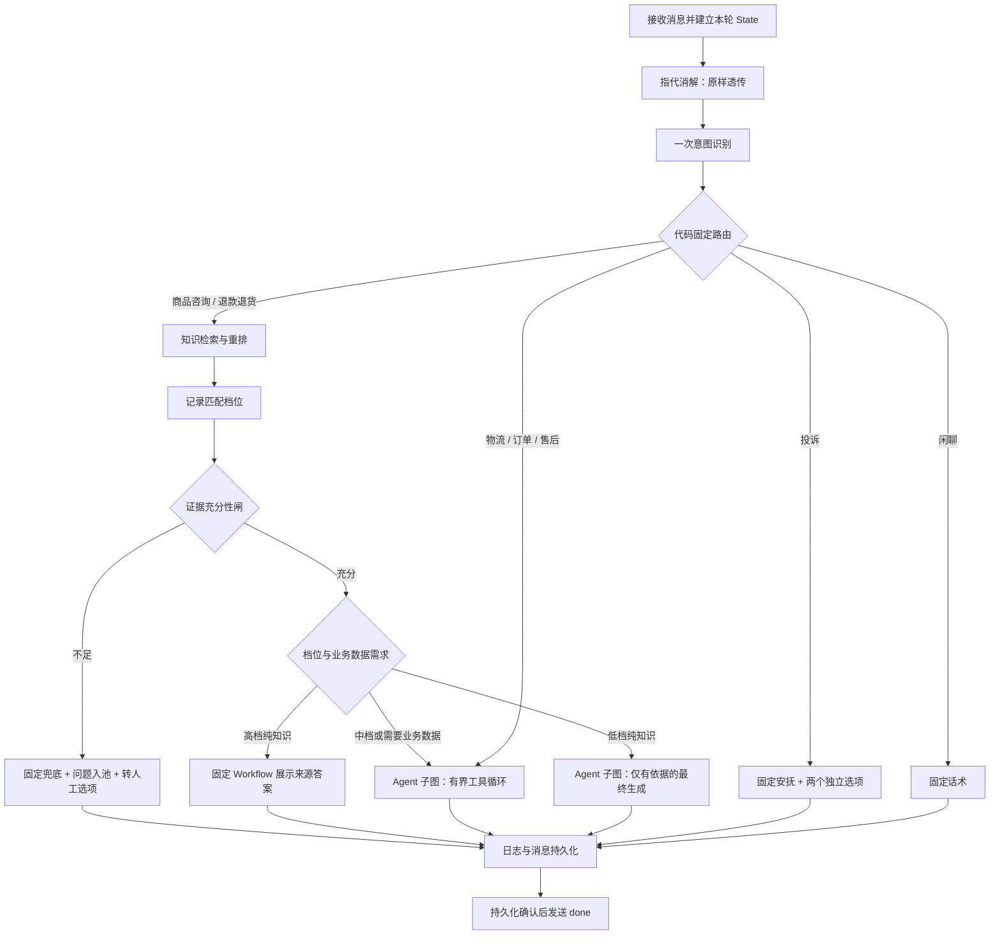

# 第 05 章：确定性 Workflow 与主力 Agent 设计

日期：2026-09-21。状态：用户已回复“规格通过”，书面规格已批准，进入实施计划编写；不代表实施计划已通过或产品已经实现。

## 1. 目标、已确认决定与本次解释

在现有客服聊天入口中，以 LangGraph 固定流程控制分流、证据闸与持久化，把可多步调用工具的主力 Agent 放在子图中。保留 FastAPI、SQLAlchemy、MySQL、原生 HTML/CSS/JavaScript、现有 OpenAI 兼容模型网关与 `.env` 配置。继续关闭思考模式，不输出模型内部推理。

用户已明确：

- 使用“外层固定 Workflow + 内层 Agent 子图”。
- 新增 Docker PostgreSQL，专门保存 LangGraph checkpoint；业务数据继续保存在 MySQL。
- 允许每轮一次 Prompt 意图识别；识别为闲聊后不再调用模型。
- 三级匹配分流只用于知识类问题。订单、物流、售后保留进入 Agent 的业务出口。
- 知识匹配 `> 0.8` 走 Workflow；`0.7～0.8` 根据意图分流；`< 0.7` 有确凿证据才生成，否则提出转人工。
- 转人工和建工单是独立选择，用户不点击就没有对应动作。

为将上述要求落实为可实施合同，本规格提出以下具体解释，供本次书面审阅确认：

1. 入口统一识别一次意图，知识中档复用结果，不进行第二次分类；否则无法先判断该问题是否属于知识类。
2. 分档采用有效候选的最高归一化 reranker 分数，两个等号都归中档：`0.7 <= s <= 0.8`。它是相关性分数，不是答案正确率。
3. 高档“走 Workflow”对纯知识问答表示核验证据后，用固定格式展示支持片段的完整答案与引用，不再调用生成模型；涉及具体订单的退货问题仍先查政策，再交给 Agent 查业务数据。
4. 各档都核验证据充分性。低档不会沿用第 4 章“低于相关性阈值直接拒答”的短路规则；低相关性与无证据分开处理。
5. “触发转人工”表示给出建议按钮，点击后才展示模拟转接效果，不自动转接、不自动建单。

本章完成的是可持久化、可审计且有执行边界的编排架构；已有订单、商品、物流工具仍返回明确标注的演示数据，不宣称接入真实商家系统或已经具备高可用部署。

## 2. 范围与依赖

实现图编排、简单意图分类、有界 ReAct、PostgreSQL checkpointer、SSE 适配、多步消息审计，以及两个独立操作按钮。指代消解节点只原样透传。本章不新增业务工具，不做正式指代消解、多轮改写、上下文策略升级、MCP 接入、自动飞轮入库或真人客服系统。

复用第 4 章的 Milvus dense/BM25 Top-50、RRF 融合、本地 bge-reranker-v2-m3、来源回查与内容指纹、Top-10 证据、引用接口和低置信度问题池。保留现有引用弹窗及前端满意度采集。

第 4 章当前代码基线为 `a1b6956`，评估修复、真实质量验收与最终上线尚未完成。已有未提交改动必须保留，不能当作干净且验收通过的依赖。本章可先完成设计；接入实施前收敛所依赖的修复并明确代码基线，真实集成验收不得用 mock 结果代替。

后端遵循 Superpowers、TDD 与独立代码评审。Prompt 和标注数据用评估集验证。沿用用户此前对聊天页面的明确例外：页面按 Vibe Coding 改造，用浏览器验证；后端按钮接口、幂等与事件合同仍执行 TDD 和评审。

## 3. 总体流程

所有分支都属于确定性的外层 Workflow。模型只能给出 Schema 合法的分类或 Agent 决策，不能修改路由表、阈值、工具权限或跳过证据闸。

## 4. 意图识别与四个出口

分类结果包含 `intent` 与 `needs_business_data`。intent 只能为物流、订单、商品咨询、退款退货、售后、投诉、闲聊；布尔字段只用于说明知识问题是否还需要查具体订单、库存等业务数据，不引入新的意图类别。分类节点一次调用、不自动重试，不输出长推理。

分类主要依据本轮透传的原话；已有完整历史仅可用于理解对话任务，不能在本节点擅自改写指代或补订单号。需要对象而用户未给出时，保留缺失，让后续追问，不造参数。

| 意图 | 出口 | 规则 |
| --- | --- | --- |
| 商品咨询 | 知识 | 强制检索；静态规格以知识为准，确需当前价格/库存时在过闸后由 Agent 查商品工具 |
| 退款退货 | 知识 | 强制先查政策；涉及某笔订单的资格判断时过闸后进入 Agent |
| 物流、订单、售后 | 业务数据 | 直接进入 Agent，不因知识库没有订单数据而转人工 |
| 投诉 | 投诉 | 不进入 Agent，固定安抚并提供两个独立选项 |
| 闲聊 | 闲聊 | 固定话术，不再调用模型，不执行工具 |

显式表达“我要投诉”走投诉；业务提问附带“你好”不能因礼貌用语变成闲聊。询问退货政策优先归退款退货，维修/换货进度等归售后。包含知识与业务操作的组合问题必须保留知识闸，不能借 `needs_business_data` 绕过政策核验。

分类返回非法 JSON、未知类别或协议异常时按技术错误结束本轮，不默认落闲聊或让模型自由回答。标注集覆盖分类歧义与复合问法，日志记录分类结果和去向。

## 5. 三级知识分流与证据闸

### 5.1 分数与检索

检索先执行原有当前问题归一化、品类精确过滤、混合召回、原文一致性校验及重排；不做多轮查询改写。category 只作用于本轮，不继承旧值。一次知识请求只运行一次检索，不因为档位反复搜索。

`s` 取回查 MySQL、状态为 done 且内容指纹一致的候选中，最高的归一化 reranker 分数。不使用 COSINE、BM25 或 RRF 的分值代替，不将 0.8 解释为 80% 正确率。无有效候选记为 `no_hits` 或 `stale_evidence`，不伪造一个 0 分；非法数值或重排失败是技术错误。

固定默认阈值为 0.7 与 0.8，进入环境配置并验证 `0 <= lower < upper <= 1`。报告如显示阈值不合适，应提出调整，不在实现时偷偷更改用户指定值。

### 5.2 独立证据闸

有有效候选时，先按现有预算选出实际能进入最终上下文的整块证据，再调用一次现有结构化充分性自评。模型必须列出支持 chunk ID，确认原文覆盖问题中的型号、适用条件、否定与关键限制；有冲突、对象不明或仅主题相近均不通过。不得以历史回答或模型常识代替当前证据。

三档统一经过这道闸，再开始任何用户可见的答案生成。最高分很高不代表证据一定充分；最高分偏低也允许在充分性检查通过后回答。这是对第 4 章在线分数短路规则的明确修改，旧评估报告和原校准产物保留其历史含义，不能冒充新策略的校准证明。

| 档位 | 闸通过后的路径 |
| --- | --- |
| `s > 0.8` | 纯知识使用固定模板展示被自评引用的完整来源答案；需要业务数据则按固定流程进入 Agent |
| `0.7 <= s <= 0.8` | 复用入口分类，根据商品咨询/退款退货任务进入 Agent，携带当前证据 |
| `s < 0.7` | 纯知识使用 Agent 子图的仅生成路径，工具关闭；需要业务数据则进入有工具权限的 Agent |

表中所有不通过情形都统一执行：固定兜底、记录低置信度问题、建议转人工，不进入 Agent。零命中、无可用整块或证据不足也走该路径，不把问题交给无依据的 LLM 尝试回答。

高档模板只取已核验来源，保留完整答案中的限制条件并附 `[n]`，不自动摘要、不拼出政策结论。需要多个来源时分块展示并分别引用；内容仍必须落在已核验的上下文和响应大小预算内。原文引用编号和点击溯源沿用第 4 章。

### 5.3 问题池与技术错误

复用 `low_confidence_questions`，入口记为 `workflow`，保存原话、会话/轮次、不能回答的原因及时间。按原 `(conversation_id, turn_id)` 幂等约束一轮最多一条。记录成功后才发送业务兜底；数据库写入失败发技术错误。

Milvus 不可用、重排失败、充分性自评格式损坏、模型超时等不能假装成“没有证据”，不作为知识缺口入池。错误路径也必须记录所到节点和安全错误码。

## 6. 主力 Agent 子图

内部流程为模型决策 → 执行一个已有工具 → 将结果回灌 → 再决策，直到准备回答、需要追问或达到预算。使用原有 LangChain 工具与工具执行器，不自己解析文本中的伪工具命令。

Agent 的可执行工具白名单只有 `query_order`、`query_product`、`query_logistics`。`query_faq` 对应的知识能力已经由外层固定节点执行，本章不让 Agent 自行重复检索；`create_ticket` 不进入自主执行白名单。既不新写业务工具，也不能让模型通过提示词或任意工具名绕过这份白名单。

每次决策最多一个工具调用，串行执行，原有参数 Schema 校验、结果大小上限、错误处理和有限重试继续有效。模型返回多个并行调用时不静默执行一部分，按协议错误处理。工具失败结果可回灌，由 Agent 根据剩余预算澄清或停止；同一个错误不得无限重试。

无工具的收敛决策使用经过校验的结构化控制结果，说明回答或追问、是否建议人工/工单、以及有依据的工单草案；这属于 Agent 控制协议，不新增可执行的业务工具。控制 JSON 不展示给用户，最终自然语言由工具关闭的生成调用流式输出。不能靠扫描生成文本中的“转人工”等词猜测是否展示按钮。

默认每轮最多 4 次工具执行、最多 5 次 Agent 决策、最多 1 次最终生成。低档纯知识直接进入最终生成，不先跑工具决策。调用参数及缺少信息必须来自用户输入、合法历史或本轮工具结果；例如缺订单号先追问，不能随机补号。

“先查订单再查物流”的验收问法应明确要求先核对订单状态再查物流；当订单结果可继续查物流时，必须看得到两个先后步骤。生产演示工具的随机状态可能导致合法提前终止，因此另用固定工具结果进行确定性测试，不改写工具数据来伪造成功路径。

## 7. Token、时限与流式边界

保留已有整轮历史裁剪策略，不新增摘要记忆或向量记忆。所有请求把 System Prompt、历史、工具 Schema、本轮工具结果和证据纳入现有保守预算估算，预留输出与安全余量。

新增每轮累计模型预算，默认 49152 个预算单位，覆盖分类、归一化、自评、Agent 决策和最终生成；预算单位仍采用项目现有保守 token 估算。每次调用前扣留输入估算与最大输出额度；存在可信 usage 时另记实际值，没有 usage 时不当作零消耗。该机制给出应用侧保守上限，不把估算当成精确账单。

业务请求沿用 60 秒总时限，知识请求沿用从本轮开始计时的 240 秒总时限；分类后的知识路由同步更新外层 SSE 截止时间。Agent 每步、工具重试、数据库写入和资源清理共享截止时间，不为每一步重新开一整轮预算。

达到工具、模型次数、token 或时间限制后不再发起新调用。若仍有最终生成预算，可基于已有事实收敛；否则用固定话术说明本轮未能完成并提供适当选项，不宣称已经完成业务处理。

仅最终生成节点的文本增量成为 `token` 事件。意图 JSON、Agent 中间决策与模型内部推理不进入答案气泡；节点和工具进度使用状态事件。固定闲聊、安抚、知识原文和兜底一次性发送，不切碎模板冒充真实逐 token 生成。

证据闸位于生成之前。流式结束后仍校验引用编号和协议完成状态；若失败，发送 error，前端将该段标成未完成，不发送成功 done。已显示的文字不能承诺可撤回，语义忠实性通过评估验证。

## 8. State、检查点与消息审计

外层 State 贯穿会话/轮次标识、原话/透传问题、当轮 category、分类结果、路由、有效来源与分数、证据判断、Agent 工具轨迹、预算、建议操作、最终回复及结束状态。只持久化可序列化数据，不放数据库连接、模型实例、运行中 Task 或密钥。

每个新轮次清空旧 category、分类、证据、分数、工具暂存、建议操作和计数，只带入已完成的合法历史。失败或取消的半轮不得进入后续模型上下文。Agent 子图每轮接收外层明确输入并返回结果，不能隐式沿用上轮证据或预算。

使用 LangGraph 官方 PostgreSQL 异步 checkpointer，现有会话 ID 对应稳定 thread_id；用户身份校验仍在进入图之前执行，不接受客户端指定任意 checkpoint。父图持有正式 checkpointer，子图使用同一持久化基础设施下的隔离命名空间；按选定 LangGraph 版本验证子图继承与恢复语义，不依赖手写文件模拟 checkpoint。

PostgreSQL 保存图状态和执行进度；MySQL 的 conversations/messages 是对话与工具审计记录。不能把两处的相同消息重复拼入 Prompt。首次迁移既有会话时，从 MySQL 的完整轮次建立初始图历史；已经有图状态的会话使用检查点中的已完成历史，旧消息仍能查询。

扩展 MySQL 消息仓储，使一轮支持多组严格配对的 assistant tool_calls / tool 结果，再加最终 assistant。历史读取验证每个 tool_call_id 与申请一一对应，不保留孤立工具结果。固定检索节点不伪造成模型发起的 `query_faq` 调用；来源快照、路由及建议操作记录在结构化事件元数据中。

为幂等审计，在 messages 增加 `event_key` 与 `event_data`：前者为 VARCHAR(128)，在会话/轮次内唯一；后者为可空 JSON。旧记录以 `legacy:{id}` 回填 event_key；迁移不重写旧正文或角色。新节点按稳定的轮次/步骤生成事件键；相同事件重放时核对内容，不重复插入、不覆盖冲突内容。

数据库间不声称存在跨库原子事务。MySQL 审计提交后 checkpoint 确认失败时，重试同一事件应幂等；所有必要写入与本轮图完成得到确认后才发送 done。数据库事务保持短时，不跨模型推理或 SSE 持有。

本章继续单应用 worker，同一会话同一时刻只允许一轮，复用已有互斥并返回 SESSION_BUSY。PostgreSQL 提供进程重启后的持久状态，不把单进程会话锁描述为多副本并发保障。

重启后可继续已完成会话。恢复时在会话互斥内核对两处状态：MySQL 已有完整 completed 轮次及最终元数据、而检查点未确认完成时，根据已提交审计修复图状态，不重新生成；MySQL 仍为 pending 的遗留轮次标为中断，图上下文只保留此前完整轮次；两处存在无法解释的内容冲突时返回恢复错误，不猜测完成状态。修复本身必须幂等，失败时不启动新一轮。

本章不自动重放中断轮次的模型调用或随机业务工具，也不声称续传旧 SSE；用户重新提问建立新轮次。恢复和幂等测试必须覆盖“某库已提交、另一处确认失败”的情况。

## 9. 转人工与建工单

投诉固定返回安抚话术，并建议 `handoff`、`create_ticket` 两个操作；其他 Agent 回复可建议零个、一个或两个。建议由后端结构化字段决定，模型的建议不等于执行授权。

### 9.1 转人工

按钮点击后只在前端显示“已转接人工客服”，再显示“您好，我是客服小猫，请问有什么可以帮您的”。按当前气泡锁定这个按钮防重复展示，不写 tickets，不改变后端会话处理状态，也不阻止后续普通聊天或点击另一按钮。

### 9.2 建工单

点击后显示问题描述、工单类型与确认/取消交互。取消不请求创建；确认才 POST 创建接口。草案来源为本轮原话和经过校验的结构化建议，不偷偷拼接其他会话内容。

新增基础设施表 `conversation_actions` 保存可执行工单建议，字段包括 action_id（UUID 主键）、conversation_id、turn_id、action_type（本章仅 create_ticket）、issue_description、ticket_type、status（offered/completed）、确定的 ticket_no、created_at、updated_at。每轮每类操作唯一，ticket_no 唯一；不保存前端模拟 handoff。生成建议记录不代表创建 tickets 行。

`POST /api/conversations/{conversation_id}/actions/{action_id}/confirm` 只接受该会话已完成轮次中真实存在的建议，验证会话归属，服务端读取持久化草案；客户端不能用任意 tool 名称或参数调用业务工具。无需新增业务工具，接口通过现有注册/执行基础设施调用原 `create_ticket`。

ticket_no 由服务端 action_id 稳定绑定。重复确认、网络重试或“ticket 已提交但 action 状态更新确认失败”都核对同一工单并返回相同编号，不重复创建。UI 在请求中禁用创建按钮，成功后显示工单号并锁定；技术失败允许重试且使用同一 action_id。

建工单不再把 conversations.status 自动改成 human_pending；工单自己的 pending 状态表达待处理。此处是对第 2 章工具仓储附带行为的必要修正，以满足两个动作独立。已存在的历史状态不批量改写。

不点击按钮不会暂停图、触发 interrupt、自动确认或生成工单；后续消息照常开始下一轮。按钮互不取消、互不绑定。

## 10. HTTP、SSE 与日志

保留 `POST /api/chat`、售后结构化提取及来源查询接口。复用 meta、tool_status、retrieval_status、sources、token、refusal、done、error；增加：

- `workflow_status`：会话/轮次、节点、阶段、简短提示、已知的路由与档位，不含内部推理。
- `message`：固定回复的完整文本和 kind（workflow/complaint/chitchat/budget），区别于真实 token 流。
- `actions`：当前轮次允许展示的建议；建工单含 action_id、可供确认的草案，转人工只带前端操作类型。

知识来源在回答前发送，稳定引用编号沿用现有合同。actions 仅在对应建议持久化且轮次正常完成后展示；前端收到 done 才启用可确认按钮。失败半轮不显示可操作的成功建议。

最终日志节点记录 session_id、turn_id、节点路径、意图、路由、最高分、档位、证据判断结果、工具名/调用 ID/次数、预算估算与可用实际 usage、时延、完成或错误码。异常路径由统一清理逻辑写终止记录，不能因为未到正常日志节点就缺失审计。

日志不输出密钥、连接串、HTTP 错误原文或模型内部推理；业务工具结果按现有安全审计合同存储。前端所有文本安全渲染，保留来源弹窗和反馈交互。

## 11. 资源、配置与部署边界

新增独立 Docker PostgreSQL 服务、持久卷和仅本机端口，用于 checkpoint；提供与演示库隔离的测试实例/数据库。连接串放 `.env`，示例文件只有占位值。版本在实施计划的依赖验证任务中选定并锁定，须先查 Context7、官方发布信息及 Python 3.13/现有 LangChain 的实际兼容性，不直接套用不同版本示例。

数据库初始化/迁移是显式命令；正常启动不自动重建表或删除 checkpoint。应用生命周期持有共享 checkpointer、模型、检索器和数据库资源，关闭时等待必要清理完成，保持已有取消处理保证。

保留现有 8001 预览直到新版本独立验收成功；先用空闲测试端口验证，再切换。不得占用其他项目的 8000。继续单 worker，避免多份本地模型占用内存。

第 4 章对外发送演示问题、知识片段及回答的真实评估授权仍待用户回复。本规格不视为解除已被自动审核拒绝的发送限制；先做本地代码、mock 协议及本机数据库验证，真实模型验收仅在明确授权后运行，未运行时如实标为待验收。

## 12. 验证与交付

### 12.1 可单测代码

TDD 覆盖七类意图到四个出口的固定映射；三级边界 0.7/0.8；无命中与技术错误的区别；高分但证据不足、低分但充分；知识闸发生在首个 token 之前；业务数据不进知识闸；高档涉及订单仍查政策再查工具；每轮只有一次分类。

Agent 测试覆盖一次调用收敛、先订单后物流、缺订单号追问、工具参数错误/超时/重试、非法工具与禁止建单、工具/模型次数上限、累计预算、总时限、断连取消以及中间控制 JSON 不进入用户回答。

真实 PostgreSQL 集成测试验证 checkpoint 持久化、应用重建后的已完成会话续接、子图隔离、旧证据清零、未完成轮次恢复策略；真实 MySQL 测试验证多步消息配对、幂等审计、问题池与建单提交确认异常。测试不能使用内存 saver 代替 PostgreSQL 验收。

### 12.2 Prompt 与数据评估

准备独立标注集：七类意图各 5 条，共 35 条，覆盖混合问法、问候加业务问题、明确投诉和缺信息；另准备 12 条证据/路由案例，覆盖三个档位、高分缺证据、低分有充分证据、型号错配、跨块政策与未知问题。

模型真实得分的档位按实际结果记录，不修改分数或挑例子冒充阈值已达质量要求。0.7/0.8 的精确边界由受控代码测试验证；真实标注集统计分类准确率、每类混淆、支持/拒答正确性、业务路由误入率、节点与工具路径、调用次数及 token。任何意图误路由、无依据答复和用户未确认建单均列出具体失败样例，不用总体平均掩盖。

### 12.3 浏览器验收

1. 政策问题日志必有检索、分档、证据闸；引用可点击定位原文。
2. “订单 1001 的物流到哪了”进入 Agent 调物流，不受知识匹配阈值影响。
3. “我要投诉”出现两个独立按钮；仅转人工不新增 ticket；仅确认建工单写入一条；都不点可继续聊天。
4. 闲聊只产生一次分类调用并返回固定话术。
5. 明确要求先订单后物流的复杂问题能显示多个工具步骤；记录演示随机数据导致的合法提前停止。
6. 无证据问题固定兜底、问题入池、显示转人工选项，不自行转接。
7. 重复确认建工单返回同一编号；刷新或进程重启不导致重复副作用。

交付功能演示命令、实际测试与评估结果、失败/限制说明及 `dev-notes/ch05.md`。规格通过后才编写实施计划，计划审阅并确定执行方式后才进入产品实现；第 5 章的合并方式单独在完成时确定。

## 13. 文档依据

- Context7：`/websites/langchain_oss_python_langgraph`，流程/条件边、消息流过滤、持久化与子图继承；`/websites/reference_langchain_python_langgraph`，StateGraph 编译和异步 PostgreSQL saver。
- [LangGraph persistence](https://docs.langchain.com/oss/python/langgraph/persistence)
- [Workflows and agents](https://docs.langchain.com/oss/python/langgraph/workflows-agents)
- [Subgraphs](https://docs.langchain.com/oss/python/langgraph/use-subgraphs)
- [Streaming](https://docs.langchain.com/oss/python/langgraph/streaming)
- Context7：`/flagopen/flagembedding`，`compute_score(normalize=True)` 的 sigmoid 归一化。
- [bge-reranker-v2-m3 官方模型卡](https://huggingface.co/BAAI/bge-reranker-v2-m3)

Context7 的子图片段展示了不同持久化模式；本规格不承诺未经安装版本验证的任意节点时间旅行或断线续传。实际接口、生命周期、checkpoint 写入时序必须在实施前用锁定版本验证。
